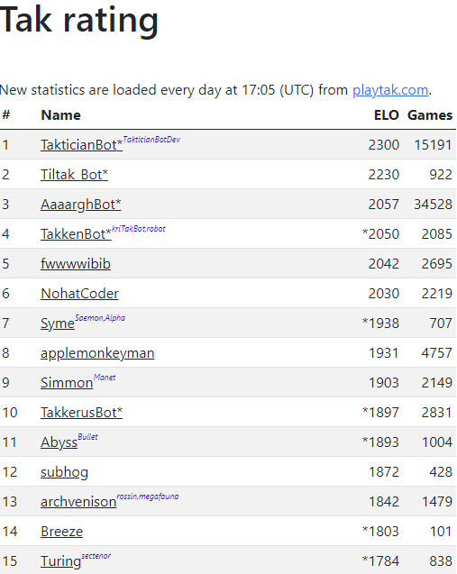
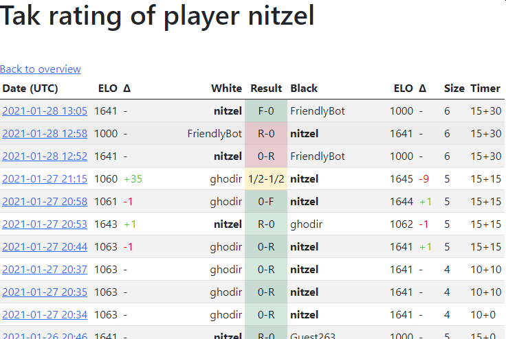

### Tak ratings display
This webserver shows the ratings of all players. One can also see how all the games one has played affect one's rating.




# Requirements to run the service locally
- Install node.js
- Run `npm install` to install the required node modules
- Run `node server.js`

# Setting up the service
- Web Server
  - `npm install pm2 --global` to keep the web server running
  - `pm2 start ecosystem.config.js` (read more about [pm2 ecosystem files](https://pm2.keymetrics.io/docs/usage/application-declaration/))
    - `pm2 save`
    - Run `pm2 startup` and follow the output to make sure your service starts after a machine reboot
  - `ufw allow 8080` or whatever port you'd like to expose it through
    - If you chose a port that was not `8080` and haven't changed the `server.js` you need to forward the port `server.js` uses to the one you exposed, in this case, 80:
      ```
      iptables -t nat -I PREROUTING -p tcp --dport 80 -j REDIRECT --to-port 8080
      ```
      Since this shall persist restarts, add it to `/etc/network/interfaces` as described [here](https://serverfault.com/a/232584/527773)
- Setting up the cronjob to download the latest database and ratings
  - `apt install jq` to parse the json file for updating
  - `crontab -e` and add:
    ```
    # Update at 17:10 UTC every day. If your machine is not UTC, change accordingly.
    # It might be the best to change your machine's timezone to UTC.
    10 17 * * * cd ~/takrating && ./update.sh
    ```
    - To set the timezone to UTC use e.g. `timedatectl set-timezone Europe/London` (and reboot)